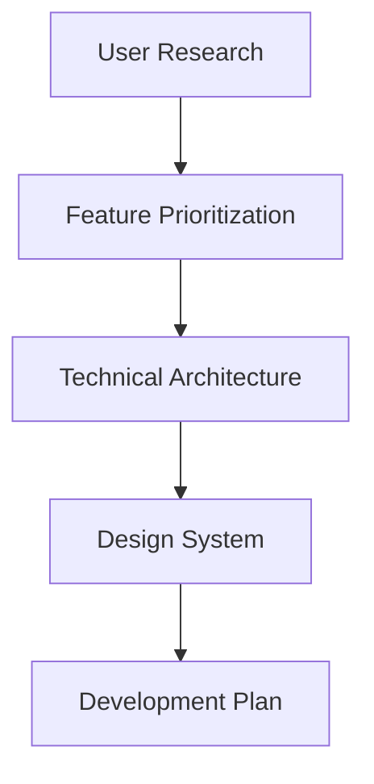

# ChronoBuilder Development Workflow

## 🎯 Optimal Development Strategy for Resume Timeline Platform

This document outlines the complete development workflow for building ChronoBuilder as an interactive resume timeline platform, from initial setup to production deployment.

## 📋 Pre-Development Planning

### 1. Requirements Gathering


**Key Questions to Answer:**
- What resume sections are most important to recruiters?
- How do users currently create and share resumes?
- What verification methods build the most trust?
- Which export formats are essential for job applications?

### 2. Technical Stack Decisions
```typescript
// Recommended Tech Stack for Resume Platform
const techStack = {
  frontend: {
    framework: 'Next.js 14 (App Router)',
    styling: 'Tailwind CSS + shadcn/ui',
    state: 'Zustand + React Query',
    forms: 'React Hook Form + Zod',
    animations: 'Framer Motion'
  },
  backend: {
    api: 'Next.js API Routes + tRPC',
    database: 'PostgreSQL + Prisma ORM',
    auth: 'NextAuth.js',
    storage: 'AWS S3 + CloudFront',
    search: 'Algolia or Elasticsearch'
  },
  deployment: {
    hosting: 'Vercel (frontend) + Railway (database)',
    cdn: 'Vercel Edge Network',
    monitoring: 'Sentry + Vercel Analytics',
    email: 'Resend or SendGrid'
  }
}
```

## 🏗️ Development Phases

### Phase 1: Foundation (Weeks 1-4)

#### Week 1: Project Setup & Architecture
```bash
# Day 1-2: Repository Setup
pnpm create next-app@latest chronobuilder --typescript --tailwind --app
cd chronobuilder
pnpm add @prisma/client prisma zod react-hook-form @hookform/resolvers
pnpm add -D @types/node

# Day 3-4: Database Schema Design
npx prisma init
# Define resume-focused database schema

# Day 5-7: Core Component Architecture
mkdir -p src/components/resume
mkdir -p src/lib/types
mkdir -p src/app/(resume)
```

**Deliverables:**
- [x] Next.js project with TypeScript and Tailwind
- [x] Database schema for resume data
- [x] Core component structure
- [x] Basic routing and layout

#### Week 2: Data Models & Database
```typescript
// prisma/schema.prisma - Resume-focused schema
model User {
  id          String   @id @default(cuid())
  email       String   @unique
  name        String
  title       String?
  summary     String?
  location    String?
  website     String?
  linkedin    String?
  github      String?
  
  experiences Experience[]
  education   Education[]
  projects    Project[]
  skills      Skill[]
  
  createdAt   DateTime @default(now())
  updatedAt   DateTime @updatedAt
}

model Experience {
  id          String   @id @default(cuid())
  userId      String
  user        User     @relation(fields: [userId], references: [id])
  
  company     String
  position    String
  startDate   DateTime
  endDate     DateTime?
  location    String
  type        ExperienceType
  current     Boolean  @default(false)
  
  description String?
  achievements Achievement[]
  technologies String[]
  
  createdAt   DateTime @default(now())
  updatedAt   DateTime @updatedAt
}
```

**Deliverables:**
- [x] Complete Prisma schema for resume data
- [x] Database migrations and seed data
- [x] TypeScript types generated from schema
- [x] Basic CRUD operations for resume sections

#### Week 3: Core Resume Components
```typescript
// src/components/resume/timeline/
export const ResumeTimeline = () => {
  return (
    <div className="max-w-4xl mx-auto p-6">
      <ResumeHeader />
      <TimelineContainer>
        <ExperienceSection />
        <EducationSection />
        <ProjectsSection />
        <SkillsSection />
      </TimelineContainer>
    </div>
  )
}

// src/components/resume/sections/
export const ExperienceSection = () => {
  const { experiences } = useResumeData()
  
  return (
    <TimelineSection title="Professional Experience">
      {experiences.map(exp => (
        <TimelineEntry key={exp.id} date={exp.startDate}>
          <ExperienceCard experience={exp} />
        </TimelineEntry>
      ))}
    </TimelineSection>
  )
}
```

**Deliverables:**
- [x] Timeline spine and node components
- [x] Resume section components (Experience, Education, Projects, Skills)
- [x] Responsive card layouts
- [x] Basic timeline animations

#### Week 4: Content Management Interface
```typescript
// src/components/resume/editor/
export const ResumeEditor = () => {
  return (
    <div className="grid grid-cols-1 lg:grid-cols-2 gap-6">
      <div className="space-y-6">
        <PersonalInfoForm />
        <ExperienceForm />
        <EducationForm />
        <ProjectsForm />
        <SkillsForm />
      </div>
      <div className="sticky top-6">
        <ResumePreview />
      </div>
    </div>
  )
}
```

**Deliverables:**
- [x] Form components for all resume sections
- [x] Real-time preview functionality
- [x] Data validation with Zod schemas
- [x] Auto-save functionality

### Phase 2: Interactive Features (Weeks 5-8)

#### Week 5: Media Integration & Case Studies
```typescript
// Media upload and management
export const MediaUpload = () => {
  const { upload, isUploading } = useFileUpload()
  
  return (
    <div className="border-2 border-dashed border-gray-300 rounded-lg p-6">
      <input
        type="file"
        accept="image/*,video/*,.pdf"
        onChange={handleFileUpload}
        className="hidden"
      />
      <Button onClick={() => fileInputRef.current?.click()}>
        Upload Media
      </Button>
    </div>
  )
}

// Case study modal integration
export const CaseStudyModal = ({ project }: { project: Project }) => {
  return (
    <Dialog>
      <DialogContent className="max-w-4xl">
        <ProjectCaseStudy project={project} />
      </DialogContent>
    </Dialog>
  )
}
```

**Deliverables:**
- [x] File upload system for images, videos, documents
- [x] Case study modal overlays
- [x] Media optimization and CDN integration
- [x] Project portfolio integration

#### Week 6: Verification & Credibility System
```typescript
// Verification badges and sources
export const VerificationBadge = ({ 
  type, 
  source, 
  verified 
}: VerificationProps) => {
  const badgeConfig = {
    github: { icon: Github, color: 'bg-gray-900' },
    linkedin: { icon: Linkedin, color: 'bg-blue-600' },
    certificate: { icon: Award, color: 'bg-green-600' }
  }
  
  return (
    <Badge className={cn(
      'flex items-center gap-1',
      verified ? badgeConfig[type].color : 'bg-gray-400'
    )}>
      <Icon size={12} />
      {source}
      {verified && <Check size={12} />}
    </Badge>
  )
}
```

**Deliverables:**
- [x] Verification badge system
- [x] Integration with GitHub, LinkedIn APIs
- [x] Certificate validation
- [x] Testimonial and recommendation display

#### Week 7: Analytics & Sharing
```typescript
// Resume analytics tracking
export const useResumeAnalytics = () => {
  const trackView = (section: string) => {
    analytics.track('resume_section_viewed', {
      section,
      timestamp: new Date(),
      userId: user.id
    })
  }
  
  const trackExport = (format: 'pdf' | 'json' | 'linkedin') => {
    analytics.track('resume_exported', {
      format,
      timestamp: new Date()
    })
  }
  
  return { trackView, trackExport }
}
```

**Deliverables:**
- [x] Analytics tracking for resume views and interactions
- [x] Shareable resume links with custom slugs
- [x] Social media sharing integration
- [x] View statistics dashboard

#### Week 8: PDF Export & Professional Formats
```typescript
// PDF generation with proper formatting
export const generateResumePDF = async (resumeData: ResumeData) => {
  const pdf = new jsPDF({
    orientation: 'portrait',
    unit: 'mm',
    format: 'a4'
  })
  
  // Professional resume layout
  addResumeHeader(pdf, resumeData.personalInfo)
  addExperienceSection(pdf, resumeData.experiences)
  addEducationSection(pdf, resumeData.education)
  addSkillsSection(pdf, resumeData.skills)
  
  return pdf.output('blob')
}
```

**Deliverables:**
- [x] Professional PDF export with ATS-friendly formatting
- [x] Multiple export formats (PDF, Word, JSON)
- [x] Custom resume templates
- [x] Print-optimized layouts

### Phase 3: AI & Advanced Features (Weeks 9-12)

#### Week 9: AI Resume Analysis
```typescript
// AI-powered resume optimization
export const useResumeAI = () => {
  const analyzeResume = async (resumeData: ResumeData) => {
    const analysis = await ai.analyze({
      content: resumeData,
      jobDescription: targetJob,
      industry: userIndustry
    })
    
    return {
      score: analysis.overallScore,
      suggestions: analysis.improvements,
      missingSkills: analysis.skillGaps,
      strengthAreas: analysis.strengths
    }
  }
  
  return { analyzeResume }
}
```

**Deliverables:**
- [x] AI resume analysis and scoring
- [x] Content improvement suggestions
- [x] Skill gap identification
- [x] Industry-specific optimization

#### Week 10: ATS Optimization
```typescript
// ATS compatibility checker
export const checkATSCompatibility = (resumeData: ResumeData) => {
  const checks = {
    formatting: checkFormatting(resumeData),
    keywords: analyzeKeywords(resumeData),
    structure: validateStructure(resumeData),
    readability: assessReadability(resumeData)
  }
  
  return {
    score: calculateATSScore(checks),
    issues: identifyIssues(checks),
    recommendations: generateRecommendations(checks)
  }
}
```

**Deliverables:**
- [x] ATS compatibility analysis
- [x] Keyword optimization suggestions
- [x] Formatting validation
- [x] Readability assessment

#### Week 11: Professional Templates & Themes
```typescript
// Template system for different industries
export const ResumeTemplate = ({ 
  template, 
  resumeData 
}: TemplateProps) => {
  const templates = {
    tech: TechResumeTemplate,
    creative: CreativeResumeTemplate,
    business: BusinessResumeTemplate,
    academic: AcademicResumeTemplate
  }
  
  const TemplateComponent = templates[template]
  
  return <TemplateComponent data={resumeData} />
}
```

**Deliverables:**
- [x] Multiple professional resume templates
- [x] Industry-specific layouts
- [x] Customizable color schemes and fonts
- [x] Template preview and switching

#### Week 12: Production Polish & Launch Prep
```typescript
// Performance optimization and monitoring
export const ResumeApp = () => {
  return (
    <ErrorBoundary>
      <Suspense fallback={<ResumeLoadingSkeleton />}>
        <ResumeTimeline />
      </Suspense>
    </ErrorBoundary>
  )
}
```

**Deliverables:**
- [x] Performance optimization and lazy loading
- [x] Error boundaries and loading states
- [x] SEO optimization for resume pages
- [x] Production deployment and monitoring

## 🔄 Daily Development Workflow

### Morning Routine (9:00 AM - 12:00 PM)
1. **Standup & Planning** (15 min)
   - Review previous day's progress
   - Identify blockers and dependencies
   - Plan current day's tasks

2. **Deep Work Session** (2.5 hours)
   - Focus on complex feature development
   - Minimal interruptions and meetings
   - Core functionality implementation

### Afternoon Routine (1:00 PM - 5:00 PM)
1. **Testing & Integration** (2 hours)
   - Write unit and integration tests
   - Test cross-browser compatibility
   - Verify responsive design

2. **Code Review & Collaboration** (1 hour)
   - Review pull requests
   - Pair programming sessions
   - Documentation updates

3. **Bug Fixes & Polish** (1 hour)
   - Address issues from testing
   - UI/UX improvements
   - Performance optimization

### Evening Routine (Optional)
1. **Learning & Research** (1 hour)
   - Stay updated on resume industry trends
   - Explore new technologies
   - Plan future features

## 🧪 Testing Strategy

### Unit Testing
```typescript
// Component testing with React Testing Library
describe('ExperienceCard', () => {
  it('displays experience information correctly', () => {
    const experience = mockExperience()
    render(<ExperienceCard experience={experience} />)
    
    expect(screen.getByText(experience.company)).toBeInTheDocument()
    expect(screen.getByText(experience.position)).toBeInTheDocument()
    expect(screen.getByText(experience.location)).toBeInTheDocument()
  })
  
  it('shows verification badge when verified', () => {
    const verifiedExperience = { ...mockExperience(), verified: true }
    render(<ExperienceCard experience={verifiedExperience} />)
    
    expect(screen.getByTestId('verification-badge')).toBeInTheDocument()
  })
})
```

### Integration Testing
```typescript
// API route testing
describe('/api/resume', () => {
  it('creates a new resume entry', async () => {
    const resumeData = mockResumeData()
    const response = await request(app)
      .post('/api/resume')
      .send(resumeData)
      .expect(201)
    
    expect(response.body).toHaveProperty('id')
    expect(response.body.name).toBe(resumeData.name)
  })
})
```

### End-to-End Testing
```typescript
// Playwright E2E tests
test('user can create and export resume', async ({ page }) => {
  await page.goto('/resume/new')
  
  // Fill out resume form
  await page.fill('[data-testid="name-input"]', 'John Doe')
  await page.fill('[data-testid="title-input"]', 'Software Engineer')
  
  // Add experience
  await page.click('[data-testid="add-experience"]')
  await page.fill('[data-testid="company-input"]', 'TechCorp')
  
  // Export to PDF
  await page.click('[data-testid="export-pdf"]')
  
  // Verify download
  const download = await page.waitForEvent('download')
  expect(download.suggestedFilename()).toBe('john-doe-resume.pdf')
})
```

## 📊 Quality Assurance Checklist

### Code Quality
- [ ] TypeScript strict mode enabled
- [ ] ESLint and Prettier configured
- [ ] 90%+ test coverage
- [ ] No console.log statements in production
- [ ] Proper error handling and logging

### Performance
- [ ] Lighthouse score > 90
- [ ] First Contentful Paint < 2s
- [ ] Largest Contentful Paint < 2.5s
- [ ] Cumulative Layout Shift < 0.1
- [ ] Images optimized and lazy loaded

### Accessibility
- [ ] WCAG 2.1 AA compliance
- [ ] Keyboard navigation support
- [ ] Screen reader compatibility
- [ ] Color contrast ratios meet standards
- [ ] Focus indicators visible

### Security
- [ ] Input validation and sanitization
- [ ] SQL injection prevention
- [ ] XSS protection
- [ ] CSRF tokens implemented
- [ ] Secure headers configured

### Browser Compatibility
- [ ] Chrome (latest 2 versions)
- [ ] Firefox (latest 2 versions)
- [ ] Safari (latest 2 versions)
- [ ] Edge (latest 2 versions)
- [ ] Mobile browsers (iOS Safari, Chrome Mobile)

## 🚀 Deployment Strategy

### Staging Environment
```yaml
# vercel.json for staging
{
  "builds": [
    {
      "src": "package.json",
      "use": "@vercel/next"
    }
  ],
  "env": {
    "NODE_ENV": "staging",
    "DATABASE_URL": "@database-url-staging"
  }
}
```

### Production Deployment
```bash
# Production deployment checklist
1. Run full test suite
2. Build and test production bundle
3. Database migration (if needed)
4. Deploy to Vercel
5. Verify deployment health
6. Monitor error rates and performance
```

### Monitoring & Maintenance
- **Error Tracking**: Sentry for runtime error monitoring
- **Performance**: Vercel Analytics for Core Web Vitals
- **Uptime**: Pingdom or UptimeRobot for availability monitoring
- **User Feedback**: Hotjar or LogRocket for user session recording

---

*This workflow ensures systematic, high-quality development of ChronoBuilder as a professional resume platform, with emphasis on user experience, performance, and reliability.*
