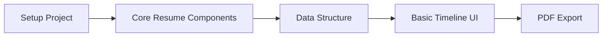
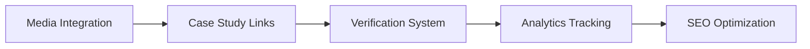
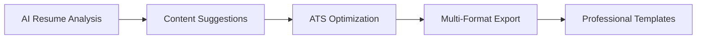

# ChronoBuilder: Interactive Resume Timeline Platform

## 🎯 Reframed Vision: From Portfolio to Professional Resume

ChronoBuilder transforms from a general timeline tool into a **specialized interactive resume platform** that showcases professional growth, achievements, and career progression in a dynamic, verifiable format.

## 📊 Research Insights: Digital Resume Trends 2025

### Key Findings from Industry Research

**Digital Resume Evolution:**
- **Interactive Artifacts**: Moving from static PDFs to living, interactive presentations
- **Progressive Disclosure**: Allow quick scanning with option to explore deeper
- **Media Integration**: Embed real work samples, case studies, and verifiable achievements
- **Visual Consistency**: Cohesive brand identity across LinkedIn, portfolio, and resume
- **Responsive Design**: Optimized for mobile-first viewing and ATS compatibility

**Critical Success Factors:**
- **Content First**: Design should enhance, not obscure, core resume information
- **Linked Evidence**: Connect claims to verifiable work samples and case studies
- **Performance Optimized**: Fast loading for impatient recruiters and hiring managers
- **Accessibility Compliant**: WCAG standards for inclusive hiring practices

## 🏗️ Resume-Focused Architecture

### Core Resume Sections (Chronological Timeline)
```typescript
interface ResumeSection {
  // Professional Experience
  experience: WorkExperience[]
  
  // Education & Certifications
  education: EducationEntry[]
  
  // Projects & Achievements
  projects: ProjectEntry[]
  
  // Skills & Technologies
  skills: SkillCategory[]
  
  // Publications & Speaking
  content: ContentEntry[]
  
  // Awards & Recognition
  recognition: AwardEntry[]
}
```

### Resume-Specific Data Structure
```typescript
interface WorkExperience {
  id: string
  company: string
  position: string
  startDate: Date
  endDate?: Date // null for current position
  location: string
  type: 'full-time' | 'part-time' | 'contract' | 'freelance'
  
  // Resume-specific fields
  achievements: Achievement[]
  technologies: string[]
  teamSize?: number
  reportingTo?: string
  keyMetrics: Metric[]
  
  // Evidence & Verification
  linkedProjects: ProjectEntry[]
  testimonials: Testimonial[]
  verificationSources: VerificationSource[]
  
  // Media & Case Studies
  media: MediaAsset[]
  caseStudyUrl?: string
}

interface Achievement {
  description: string
  impact: string // quantified impact
  metrics?: Metric[]
  evidence?: string[] // links to proof
}

interface Metric {
  label: string
  value: string | number
  improvement?: string // "increased by 40%"
  timeframe?: string
}
```

## 🎨 Resume-Focused UI/UX Design

### Primary Layout: Professional Resume Timeline
```
┌─────────────────────────────────────────────────────────────────┐
│  [Your Name] - [Professional Title]              [PDF] [Share]   │
│  [Contact Info] • [LinkedIn] • [Portfolio] • [GitHub]           │
├─────────────────────────────────────────────────────────────────┤
│  📋 Professional Summary                                         │
│  Brief, compelling overview of experience and value proposition  │
├─────────────────────────────────────────────────────────────────┤
│  💼 PROFESSIONAL EXPERIENCE                      [⏱️ 5 years]    │
│  ─────────────────────────────────────────────────────────────── │
│  ○ 2024-Present  Senior Full-Stack Developer                    │
│  │                TechCorp Inc. • San Francisco, CA             │
│  │                ┌─────────────────────────────────────────┐   │
│  │                │ • Led team of 5 developers             │   │
│  │                │ • Increased app performance by 40%     │   │
│  │                │ • Shipped 3 major features             │   │
│  │                │ [📊 Metrics] [🔗 Projects] [💬 Testimonial] │
│  │                └─────────────────────────────────────────┘   │
│  │                                                              │
│  ○ 2022-2024    Full-Stack Developer                           │
│  │               StartupXYZ • Remote                            │
│  │               ┌─────────────────────────────────────────┐    │
│  │               │ • Built MVP from scratch               │    │
│  │               │ • Reduced load times by 60%            │    │
│  │               │ • Implemented CI/CD pipeline           │    │
│  │               │ [📱 Demo] [⭐ GitHub] [📈 Analytics]     │    │
│  │               └─────────────────────────────────────────┘    │
│  │                                                              │
│  📚 EDUCATION & CERTIFICATIONS                                  │
│  ─────────────────────────────────────────────────────────────── │
│  ○ 2022         AWS Solutions Architect Certification          │
│  ○ 2020         B.S. Computer Science • State University       │
│                                                                 │
│  🚀 KEY PROJECTS                                                │
│  ─────────────────────────────────────────────────────────────── │
│  ○ 2024         E-commerce Platform Redesign                   │
│  ○ 2023         Open Source Contribution to React              │
│                                                                 │
│  🛠️ TECHNICAL SKILLS                                            │
│  ─────────────────────────────────────────────────────────────── │
│  Languages:  [TypeScript ████████] [Python ███████]            │
│  Frameworks: [React ████████] [Node.js ███████]                │
│  Tools:      [AWS ██████] [Docker ██████]                      │
└─────────────────────────────────────────────────────────────────┘
```

### Mobile-Optimized Resume View
```
┌─────────────────────────────┐
│ John Doe                    │
│ Senior Full-Stack Developer │
│ john@email.com • LinkedIn   │
├─────────────────────────────┤
│ 💼 EXPERIENCE [5 years]     │
│ ─────────────────────────── │
│ ○ 2024-Now                  │
│   Senior Developer          │
│   TechCorp Inc.             │
│   • Led team of 5           │
│   • 40% performance boost   │
│   [View Details ▼]          │
│                             │
│ ○ 2022-2024                 │
│   Full-Stack Developer      │
│   StartupXYZ                │
│   • Built MVP from scratch  │
│   • 60% faster load times   │
│   [View Details ▼]          │
│                             │
│ 📚 EDUCATION                │
│ 🚀 PROJECTS                 │
│ 🛠️ SKILLS                   │
│                             │
│ [Download PDF] [Share]      │
└─────────────────────────────┘
```

## 🔄 Development Workflow Strategy

### Phase 1: Resume Foundation (Weeks 1-4)


**Week 1-2: Project Setup & Core Components**
- Initialize Next.js monorepo with resume-focused structure
- Create core resume data models and TypeScript interfaces
- Build basic timeline spine and entry card components
- Implement responsive layout system

**Week 3-4: Resume Sections & Content Management**
- Build experience, education, projects, skills sections
- Create content management interface for adding/editing entries
- Implement chronological sorting and filtering
- Add PDF export functionality for traditional resume needs

### Phase 2: Interactive Features (Weeks 5-8)


**Week 5-6: Media & Evidence Integration**
- Add support for project screenshots, demo videos, code samples
- Implement case study linking and modal overlays
- Create testimonial and recommendation display
- Build metrics and achievement visualization

**Week 7-8: Verification & Professional Features**
- Implement verification badges for achievements and roles
- Add LinkedIn integration for consistency checking
- Create shareable resume links with custom domains
- Build analytics dashboard for resume views and engagement

### Phase 3: AI & Advanced Features (Weeks 9-12)


**Week 9-10: AI-Powered Enhancements**
- Implement AI resume analysis and improvement suggestions
- Add automatic skill extraction from job descriptions
- Create content recommendations based on industry trends
- Build ATS (Applicant Tracking System) compatibility checker

**Week 11-12: Professional Polish & Templates**
- Create multiple professional resume templates/themes
- Add advanced export options (PDF, Word, LinkedIn format)
- Implement custom domain support for personal branding
- Build recruiter-friendly sharing and tracking features

## 🎯 Resume-Specific Features

### Core Resume Features
- **Chronological Experience Timeline**: Primary focus on work history
- **Achievement Quantification**: Metrics and impact measurement
- **Skill Progression Tracking**: Show growth over time
- **Project Portfolio Integration**: Link to detailed case studies
- **Verification Badges**: Credible achievement validation
- **ATS-Friendly Export**: Traditional resume format compatibility

### Professional Enhancements
- **Custom Domain Support**: yourname.resume or yourname.chronobuilder.dev
- **Recruiter Analytics**: Track who views your resume and when
- **Version Control**: Tailor resume for different job applications
- **Collaboration Features**: Get feedback from mentors/peers
- **Integration Hub**: LinkedIn, GitHub, portfolio sync
- **Privacy Controls**: Public/private sections, selective sharing

### AI-Powered Assistance
- **Resume Optimization**: Suggest improvements based on job descriptions
- **Content Generation**: Help write achievement descriptions
- **Skill Gap Analysis**: Identify missing skills for target roles
- **Industry Benchmarking**: Compare against successful professionals
- **Interview Preparation**: Generate talking points from resume content

## 📊 Success Metrics & Analytics

### User Engagement Metrics
- **Resume Completion Rate**: Percentage of users who complete all sections
- **Time to First Share**: How quickly users share their resume
- **View-to-Contact Ratio**: Conversion from resume views to contact
- **Return Usage**: How often users update their resume

### Professional Impact Metrics
- **Interview Conversion**: Resume views that lead to interviews
- **Job Application Success**: Tracking application outcomes
- **Recruiter Engagement**: Time spent viewing resume sections
- **Social Sharing**: LinkedIn, Twitter, email shares

### Technical Performance Metrics
- **Load Time**: Resume page performance across devices
- **PDF Generation Speed**: Export functionality performance
- **Mobile Usability**: Touch interaction and responsive design
- **SEO Performance**: Search engine visibility and ranking

## 🚀 Go-to-Market Strategy

### Target Audiences
1. **Job Seekers**: Professionals looking to stand out in competitive markets
2. **Career Changers**: People transitioning between industries or roles
3. **Freelancers**: Independent professionals showcasing diverse projects
4. **Recent Graduates**: New professionals building their first resume
5. **Executives**: Senior professionals with extensive experience to showcase

### Competitive Advantages
- **Interactive Timeline**: More engaging than static PDFs
- **Verification System**: Builds trust with employers
- **AI Optimization**: Helps users improve resume effectiveness
- **Modern Design**: Appeals to tech-forward companies
- **Evidence-Based**: Links claims to actual work samples

### Launch Strategy
1. **Beta with Tech Professionals**: Start with developer/designer community
2. **LinkedIn Integration**: Leverage existing professional networks
3. **Content Marketing**: Resume tips, career advice, success stories
4. **Recruiter Partnerships**: Get feedback from hiring professionals
5. **Open Source Community**: Build contributor ecosystem

## 🔧 Technical Implementation Priority

### Must-Have (MVP)
- Responsive timeline resume layout
- Core resume sections (experience, education, skills)
- PDF export functionality
- Basic media integration
- Mobile-optimized design

### Should-Have (V1.1)
- LinkedIn integration
- Custom domains
- Analytics dashboard
- Multiple templates
- Verification system

### Could-Have (V2.0)
- AI resume optimization
- ATS compatibility checker
- Collaboration features
- Advanced analytics
- API for integrations

---

*This strategy reframes ChronoBuilder as a specialized, professional resume platform that leverages timeline visualization to create compelling, verifiable, and interactive career narratives.*
